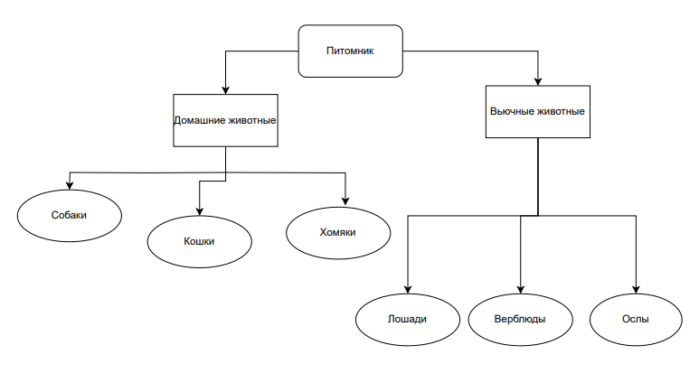

Итоговая контрольная работа

Задание.
(Скриншоты, история терминала находятся в папке LinuxOC(1-5) )

1. Используя команду cat в терминале операционной системы Linux, создать
   два файла Домашние животные (заполнив файл собаками, кошками,
   хомяками) и Вьючные животными заполнив файл Лошадьми, верблюдами и
   ослы), а затем объединить их. Просмотреть содержимое созданного файла.
   Переименовать файл, дав ему новое имя (Друзья человека).

В терминале были введены следующие команды для решения пункта 1:

      cat > Pets 
      Dogs
      Cats
      Humsters

      cat > Pack_animals
      Horses
      Camels
      Donkeys

      sudo cat Pets Pack_animals > All_animals_Pets_Pack
      sudo cat All_animals_Pets_Pack
      mv All_animals_Pets_pack Humanfriends

2. Создать директорию, переместить файл туда.

В терминале были введены следующие команды для решения пункта 2:
      
         mkdir Friends
         mv Humanfriends Friends/

3. Подключить дополнительный репозиторий MySQL. Установить любой пакет
   из этого репозитория

В терминале были введены следующие команды для решения пункта 3:

         wget https://dev.mysql.com/get/mysql-apt-config_0.8.26-1_all.deb
       
         sudo dpkg -i mysql-apt-config_0.8.26-1_all.deb
         sudo apt install mysql-server
         sudo apt update
         systemctl status mysql

4. Установить и удалить deb-пакет с помощью dpkg.
   В терминале были введены следующие команды для решения пункта 4:

         wget https://dev.mysql.com/get/Downloads/MySQLGUITools/mysql-workbench-community_8.0.34-1ubuntu22.04_amd64.deb
         sudo dpkg -i mysql-workbench-community_8.0.34-1ubuntu22.04_amd64.deb
         mysql-workbench-community --version
         sudo dpkg -r mysql-workbench-community
         (sudo apt autoremove)

5. Выложить историю команд в терминале ubuntu
   В терминале были введены следующие команды для решения пункта :
            
            history
cat > Pets

1450  cat > Pack_animals

1451  sudo cat Pets

1452  sudo cat Pack_animals

1453  cat Pets Pack_animals > All_animals_Pets_Pack

1454  sudo cat Pets Pack_animals > All_animals_Pets_Pack

1455  sudo cat All_animals_Pets_Pack

1456  cat Humanfriends

1457  sudo cat Humanfriends

1458  mkdir Friends

1459  ll

1460  ls

1461  mv Humanfriends Friends/

1462  ls

1463  cd Friends/

1464  ls

1465  sudo ls

1466  clear

1467  mysql --version

1468  sudo apt install mysql-server

1469  mysql --version

1470  sudo dpkg -i mysql-apt-config_0.8.29-1_all.deb

1471  wget https://dev.mysql.com/get/mysql-apt-config_0.8.29-1_all.deb

1472  sudo dpkg -i mysql-apt-config_0.8.29-1_all.deb

1473  mysql --version

1502  sudo apt update

1503  sudo apt install mysql-server

1504  mysql --version

1505  systemctl status mysql

1506  wget https://dev.mysql.com/get/mysql-apt-config_0.8.26-1_all.deb

1507  sudo dpkg -i mysql-apt-config_0.8.26-1_all.deb

1508  sudo apt install mysql-server

1509  sudo apt update

1510  systemctl status mysql

1511  ll

1512  ls

1513  cd tmp

1514  ls

1515  clear

1516  wget https://dev.mysql.com/get/Downloads/MySQLGUITools/mysql-workbench-community_8.0.36-1ubuntu22.04_amd64.de

1517  sudo dpkg -i mysql-workbench-community_8.0.34-1ubuntu22.04_amd64.deb

1518  sudo dpkg -i mysql-workbench-community_8.0.36-1ubuntu22.04_amd64.deb

1519  wget https://dev.mysql.com/get/Downloads/MySQLGUITools/mysql-workbench-community_8.0.34-1ubuntu22.04_amd64.de

1520  sudo dpkg -i mysql-workbench-community_8.0.34-1ubuntu22.04_amd64.deb

1521  clear

1522  wget https://dev.mysql.com/get/Downloads/MySQLGUITools/mysql-workbench-community_8.0.34-1ubuntu22.04_amd64.deb

1523  sudo dpkg -i mysql-workbench-community_8.0.34-1ubuntu22.04_amd64.deb

1524  mysql-workbench-community --version

1525  sudo dpkg -r mysql-workbench-community

1526  history

6. Нарисовать диаграмму, в которой есть класс родительский класс, домашние
   животные и вьючные животные, в составы которых в случае домашних
   животных войдут классы: собаки, кошки, хомяки, а в класс вьючные животные
   войдут: Лошади, верблюды и ослы).

(Диаграмма в формате pdf в папке Chart_animals)

